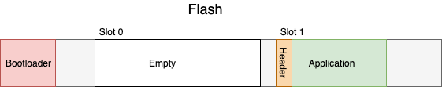
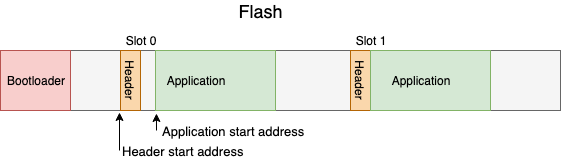

# Smoke test for bootloader

This folder contains smoke tests for Mbed bootloader.

Content of this directory is ignored from normal Greentea builds using `.mbedignore`
because we require special scripts to generate final test image.

## Test method

Smoke test is using unmodified bootloader and "Hello World" application to verify whether device is able to  update & flash and boot.
This is done by combining bootloader, and application to a single binary image:



Now bootloader needs to do following:

1. Verify slot0 header to be empty and notice that main app is corrupted or missing.
1. Verify slot1 header to be correct and contain proper application.
1. Update the main image
1. Boot the main image
1. And once booted, we can see the message "Hello World" appearing on the screen.

After the update sequence, the bootloader has copied the application into the bootable section:



And now the main (slot 0) section is bootable and bootloader can continue.

Proper boot looks like this:

```
Mbed Bootloader
[DBG ] Active firmware integrity check failed
[DBG ] Update active firmware
[DBG ] Erase active application
[DBG ] Write header
[DBG ] Copy application
[DBG ] Verify application
[DBG ] New active firmware is valid
booting...

Hello World
```

This is now verified using `mbedhtrun --compare-log` to contain correct output for each stage listed above.
The `mbedhtrun --compare-log` method is explained here: https://github.com/ARMmbed/mbed-os-tools/tree/master/packages/mbed-host-tests#testing-mbed-os-examples

## Requirements

* Device must have big enough flash for holding bootloader and two application images.
* Configuration must be defined for such scenario. For most, we are using `internal_flash_no_rot.json`
* Device must support flashing and running with `mbedhtrun`
* Exact flash addresses needs to be filled in [configs.md](configs.md)

## Running

1. Build the bootloader, for example `mbed compile -m K64F --profile tiny.json`
1. Go to smoke test directory `cd TESTS/smoke`
1. Build smoke test image `./build.sh K64F`
1. Run in RAAS: `./test.sh K64F https://ruka.mbedcloudtesting.com:443`
